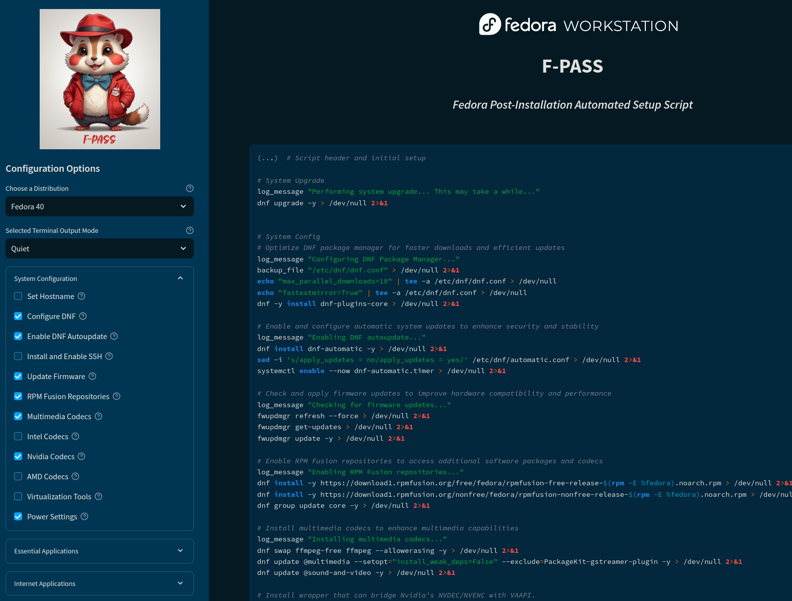

# F-Pass - Fedora Post-install Automated Setup Script



## Overview

A web application, powered by Streamlit for generating a customized shell script to automated Fedora Workstation installation. The app provides an intuitive interface for choosing system configurations, applications, and customization options. It is currently open for testing and is generally suitable for production use, although minor bug fixes and code improvements are ongoing.

## Latest Changes
*(As of 2024-09-18)*
- Many code updates, optimizations, and rewrites
  - More veritile while coming in at a smaller size
  - Still many thanks to [k-mktr](https://github.com/k-mktr) for the original version and inspiration!
- Selectbox to choose from currently supported distributions (currently only Fedora 40)
- Default to verbose mode
  - Prevents the risk of script failure due to an important prompt being unknowingly discarded
- More categories and options
  - New app and game choices
  - Power options for both Gnome and KDE
  - Many more DNF or Flatpak install choices
  - Multiple useful choices for installing VirtualBox and Docker
- Verify a valid hostname has been entered
  - If invalid, a warning message with instructions will appear
  - If invalid or not entered, a default loaded from the json will be used
- Ability to enable 3rd party repositories
  - Solves the risk of failed installs if 3rd party repositories weren't enabled when installing Fedora
  - All enabled repositories, including those enabled by this script, will be updated before any apps are installed
- Ability to add aditional swap space via a swapfile
  - Can help with virtual machines, where their need for guestOS RAM & VRAM may exceed the amount of system RAM available
  - Only BTRFS and EXT4 are supported
  - SSD and HDD specific commands
  - Check for existing swapfiles before executing
    - If found, user will be informed of how many and current total swapspace (excluding ZRAM)
    - If found, user will also be asked if the want to add the addition swap space or cancel

*(As of 2024-09-01)*
- Support for different distros via json files
  - Currently only Fedora 40 is officially supported
  - Should work with other Fedora releases
  - Should also work with other distros that are based on Fedora or use dnf and yum
- Automatic sidebar and menu generation based on the selected distro/json file
- Much of the code has been greatly rewritten
  - Variable and dictionary naming has been standardized (might be more such changes coming)
  - Code has been simplified in many areas, reducing redundancy and improving functionality
- Improvements to the json file
  - Reworked and standardized the structure of the data
  - New apps added
  - Initial work to better organize and categorize apps

## Features

**Features**
- **Script Preview**: View a preview of the generated script before downloading.
- **One-Click Download**: Generate and download the customized script with a single click.
- **Output Mode Selection**: Choose between Quiet (hide command output) and Verbose (show full output) modes.

**Menu Categories**
- **System Configuration**: Set hostname, configure DNF, addtional repositories, codecs, and other useful setup options.
- **Recommended Apps**: A range of essetial and/or popular command-line tools and utilities.
- **Internet Apps**: A selection of popular browsers, messaging clients, download apps, and more.
- **Productivity Apps**: Office suites, notetaking apps, and other useful apps.
- **Virtualization & Container Apps**: Options for virtual machines and Docker containers.
- **Programming Apps**: A selection of editors, IDEs, automation, and dev environments.
- **Mulitmedia Apps**: Video, music, ebook readers, and image viewers and editors.
- **Gaming Apps**: A collection of popular game stores, launchers, games, and emulators.
- **Management Apps**: Password managers, system management, hardware support, and more.
- **Customization**: Additional fonts and themes.
- **Advanced Settings**: Add additional swap space
- **Custom Script**: Add custom shell commands to be included in the generated script.

## Requirements

- Python 3.9+
- Streamlit
- A modern web browser

## Installation

1. Clone this repository:
   ```
   git clone https://github.com/papercutter0324/F-PASS.git
   cd ./F-PASS
   ```

2. Install the required Python packages:
   ```
   pip install streamlit pip --upgrade
   ```

## Usage

1. Run the Streamlit app:
   ```
   streamlit run app.py
   ```

2. Open your web browser and navigate to the URL provided by Streamlit (usually `http://localhost:8501`) or use [our official public instance](https://nattdf.streamlit.app)
  - One may open automatically.

3. In the sidebar, select your distro and output mode (Quiet or Verbose) to control the amount of details shown while the script is running.

4. Choose your desire settings, apps, and customizations from the sub-menus.

5. (Optional) Insert custom shell commands in the Advanced section.

6. Review the script in the preview window and click "Build Your Script".

7. Click "Download Your Script" and follow the provided instructions to make the script executable.

8. Navigate to where you saved the script and run it (as shown in the instructions).

## Script Template

The `script_template.sh` file serves as the base for the generated script. It includes:

- Error handling and logging functionality
- User prompts for optional steps
- A modular structure that allows for easy customization

## Caution

The generated script will make system-wide changes. Always review the script contents before running it on your system.

## Contributing

Contributions are welcome! If you'd like to see additional apps or options included, please open an issue or submit a pull request. Here are some ways you can contribute:

- Suggest new applications or system configurations to include
- Report bugs or issues you encounter
- Enhance the user interface or add new features

## License

This project is licensed under the GNU General Public License v3.0 - see the [LICENSE](LICENSE) file for details.

## Acknowledgements

- Original Version: [Fedora Workstation: Not Another 'Things To Do'!](https://github.com/k-mktr/fedora-things-to-do)
- Streamlit
- Contributors

## Roadmap

**In-Progress and Completed
- ✅ Intuitive interface options
- ✅ Advanced Section for custom shell commands
- ✅ Automatically generate menus based on the chosen distro/json file
- ✅ Adding more swap space (BTRFS, EXT4 only)
  - ✅ Check if swapfiles already exist before adding
  - ✅ Prompt to add additional swapfile or cancel
- ✅ Expand the Docker and VirtualBox options
- Distro agnostic (99% complete)
  - All data and commands are loaded from a json file
  - Move initial system upgrade code to the json file
  - Provide json template for others to make for other distros
- Improved dependency checks (for those not handled automatically by dnf)
- Improved sidebar menu
  - Better organization and categorization of apps
  - More applications and configuration options
  - Automatically close other sub-menus when another is opened

Future plans for this project include:
- Support for installing other desktop environments
- Customization, theme, and icon options for Gnome and KDE
- Common file templates (Useful when right-clicking and creating a new file)
- Recommended and predefined configuration profile support
- Post-reboot script support

## FAQ

### Is this script safe to run on my Fedora system?

The script is designed to be safe, but as with any system-wide changes, it's important to review the script contents before running it. We provide a preview feature so you can see exactly what the script will do. Always ensure you understand the changes that will be made to your system.

### Can I use this script on other Linux distributions?

Currently, this script is specifically designed for Fedora Workstation. While some commands might work on other distributions, we don't recommend using it on non-Fedora systems without significant modifications. We're considering developing versions for other distributions in the future.

### How often is the application list updated?

We strive to keep the application list up-to-date with the latest stable versions available for Fedora. However, the exact update frequency may vary. If you notice an outdated application or would like to suggest a new one, please open an issue on our GitHub repository.

### Can I modify the script after it's generated?

Absolutely! The generated script is just a starting point. You're free to modify it to better suit your needs. Just be careful to maintain proper syntax and consider the potential impacts of any changes you make.

### What if I encounter an error while running the script?

The script includes error handling to log issues it encounters. If you run into problems, check the log file (default location: `/var/log/F-PASS.log`) for more information. If you can't resolve the issue, feel free to open an issue on our GitHub repository with the error details.

### Does this script handle system updates?

Yes, the script includes options for configuring DNF (Fedora's package manager) and enabling automatic updates.

### Can I run the script multiple times?

While in theory this should be fine, it's not recommened. With all the options available, it's not guaranteed that all option can safely be re-run. It's best to run it once on a fresh Fedora installation. If you need to make changes later, generate a new script with only the additional changes you need.

### How can I contribute to this project?

We welcome contributions! You can contribute by suggesting new features, reporting bugs, improving documentation, or submitting pull requests. Check out our "Contributing" section in the README for more details.

### Why not use Ansible instead of a shell script?

This is designed to be a simple, user-friendly app for newbies and experienced users. While Ansible is a powerful tool for configuration management, it's not easily used by less-experienced users.
